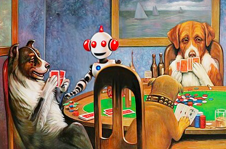

## Simple Poker Bots

### About

- A project for testing simple poker bots against each other in six handed games. 
- There's no machine learning or AI or anything smart. Each bot follows simple rules.
- No dependencies

### How to run

Open the .csproj file in your favorite c# IDE like Jetbrains Rider, Visual Studio, etc. Click build and run and you should see logs of simulated hands.